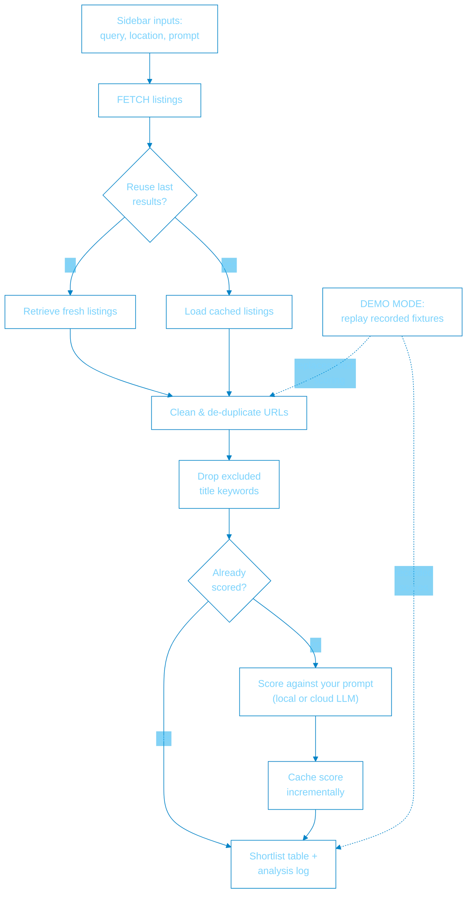

# LLM Job Fit Analyzer

An intelligent job search assistant that scrapes job advertisements and uses **any OpenAI-compatible LLM (local or cloud)** to score them against your unique career profile. It features local caching to save costs and an incremental-save mechanism to prevent data loss.

Why I built this:

Tired of reading job descriptions that feel like a recipe blog post. We've all seen them: the job ads that spend ten paragraphs detailing the company's "inspirational founding story" and the CEO's self-discovery trip to Peru before finally mentioning they need a Java dev. If you're tired of hunting for actual technical requirements through a forest of corporate buzzwords, or companies that can't even describe what they need, this tool might be for you.

What this isn't intended for:

To entirely automate the job search process. This tool is intended to shortlist job listings, with the user making the final selection and applying for the job themselves.

## Features

- **Any OpenAI-compatible LLM:** Point it at a local server (llama.cpp/llama-swap, Ollama) or a cloud API (OpenAI, OpenRouter, Gemini's OpenAI endpoint) — switching engine is config, not code.
- **Smart Caching:** Local JSON caching avoids re-scoring jobs you've already analyzed (0ms latency for known jobs).
- **URL Normalization:** Automatically strips tracking parameters (UTM tags, trk IDs) to ensure stable cache hits.
- **Incremental Saving:** Updates your local database after every successful score to protect against crashes.
- **Demo Mode:** Fully self-contained record/replay — no API keys or network required.

---

## How it works

**Vector_Pathfinder** turns a wall of job adverts into a ranked shortlist. It fetches listings for your search, scores each one against a profile/prompt you control using a local or cloud LLM, and surfaces the best matches with a short technical analysis per role. Scores are cached locally so re-runs are instant, and a self-contained demo mode replays recorded data — no API keys or network required.

<!-- FLOW_DIAGRAM:START — generated from static/flow.mmd by scripts/sync_flow_diagram.py; do not edit this block by hand -->

<!-- FLOW_DIAGRAM:END -->

> **`static/flow.mmd` is the single source of truth** for this diagram — the app renders it live in the **HOW_IT_WORKS** panel (with an **Expand** button for a full-size view). The block above is generated from it; after editing `flow.mmd`, run `uv run python scripts/sync_flow_diagram.py` to refresh it (a test fails if they drift).

---

## Installation & Setup

This project uses [uv](https://docs.astral.sh/uv/).

### Prerequisites

- **Python 3.14+**
- **An OpenAI-compatible LLM endpoint** — local (e.g. [llama.cpp](https://github.com/ggml-org/llama.cpp) / [llama-swap](https://github.com/mostlygeek/llama-swap), [Ollama](https://ollama.com)) or a cloud API (OpenAI, OpenRouter, Gemini's OpenAI endpoint, ...)
- **SerpApi Key** (for Google Jobs scraping — only needed for live scrapes)

### Install & run

```bash
# Install dependencies and create virtual environment automatically
uv sync

# Run the app locally
uv run streamlit run app.py --server.headless true --server.address=127.0.0.1
```

### Configuration (`.env`)

Configuration lives in a gitignored `.env` (also `.dockerignore`d, so it's never
baked into an image). Any value can equally be supplied as an environment variable or
a secret file — see [Secrets](#secrets) for the recommended way to handle keys.

```bash
DEBUG=false

# LLM — any OpenAI-compatible /v1 endpoint. Switching engine = change these three.
#   llama-swap (local):  http://localhost:8080/v1   (see deploy/llama-swap)
#   Ollama (local):      http://localhost:11434/v1
#   cloud:               e.g. https://api.openai.com/v1  (set a real LLM_API_KEY)
LLM_BASE_URL=http://localhost:8080/v1
# Blank = none, for local servers that don't authenticate. Set a real key for cloud.
# (Better: leave blank here and inject it as a secret — see below.)
LLM_API_KEY=
# Blank = use the first model the endpoint serves (/v1/models). For llama-swap this
# must match a key in its config.yaml.
LLM_MODEL=gemma4:12b
DEFAULT_TEMPERATURE=1.0
MAX_ATTEMPTS=5

# Job scraping (SerpApi google_jobs) — required to aggregate jobs.
# Get a key at https://serpapi.com/  (leave blank here; inject as a secret)
SERPAPI_KEY=
DEFAULT_SEARCH_PAGES=8
USE_LAST_SCRAPE=true
# Engine/language/country defaults (JSON); query + location are set in the app UI.
GOOGLE_SEARCH_PARAMS='{"engine": "google_jobs", "hl": "en", "gl": "uk"}'

PROMPT_FILE=.prompt.txt
```

### Secrets

Keep real secrets (`LLM_API_KEY`, `SERPAPI_KEY`) out of `.env` and inject them at
runtime. The app reads file-based secrets from `SECRETS_DIR` (default `/run/secrets`),
so **podman / docker secrets** work with no extra config — the secret name just has to
match the setting:

```bash
# Store the key once (here piped from a password manager rather than typed/echoed)
pass show serpapi/key | podman secret create serpapi_key -

podman run --rm -p 8501:8501 \
  --secret serpapi_key \
  --secret llm_api_key \   # only if your LLM endpoint is an authenticated cloud API
  job-analyzer:latest
```

A **blank** key in `.env` (e.g. `LLM_API_KEY=`) is treated as *unset* and falls
through to the injected secret — it will not shadow it. For local development, pipe a
key straight from a password manager (`pass`, `op`, ...) into `podman secret create`,
or export it as a shell env var for a quick `uv run` — either keeps secrets off disk
and out of git.

The search query, location (typeahead against SerpApi's Locations API), title
keyword exclusions, and the scoring prompt are all set in the app's sidebar — no
config needed.

---

## Scoring Logic (Example Prompt)

The scoring prompt is editable in the app sidebar, pre-filled from `.prompt.txt`. This file defines your "Digital Recruiter" persona and technical requirements. The job advert is appended automatically during the scoring loop, so the prompt only needs to contain your instructions.

A ready-to-run, generic version ships as [`prompt.example.txt`](prompt.example.txt). Copy it and tailor it to your background:

```bash
cp prompt.example.txt .prompt.txt
```

`.prompt.txt` is gitignored, so your personalised copy stays private. You can also load any `.txt` straight into the prompt box from the sidebar's upload control.

### Prompt structure

The template below shows the expected sections. Replace all `[PLACEHOLDER]` brackets with your own preferences — or start from `prompt.example.txt` and edit in place.

```
### System Role
You are a Lead Technical Headhunter specializing in [YOUR_FIELDS_OF_CHOICE_HERE]. Evaluate the job advert strictly against the provided profile.

### Candidate Profile
- Core: [YOUR_CORE].
- Expertise: [YOUR_EXPERTISE].
- Philosophy: [YOUR_PHILOSOPHY].
- Domain: [YOUR_DOMAINS].
- Preferable: [YOUR_PREFERENCES].

### Evaluation Protocol
1.  Assign "overall_fit" (0–10). [SOMETHING_TERRIBLE] role is a 2. [SOMETHING_GREAT] is a 10.
2.  Determine "engagement_type" (Contract, FTC, or Permanent).
3.  Extract 3 "technical_pros" (e.g., [LIST_PROS]).
4.  Identify 3 "risk_factors" (e.g., [LIST_RISK_FACTORS]).

### JSON Schema
{
  "job_title": string,
  "company": string,
  "salary": number | null,
  "overall_fit": integer,
  "engagement_type": string,
  "triage_summary": string,
  "technical_pros": [string],
  "risk_factors": [string],
  "red_flags": string
}

### Constraints
- "triage_summary" must be exactly 2 sentences: 1) The technical core of the job. 2) Why it specifically fits/misses your niche.
- OUTPUT ONLY COMPACT JSON. NO MARKDOWN. NO PREAMBLE.
```

> The job advert is appended automatically after your instructions, so the prompt does not need an input/`{{INSERT_JOB_ADVERT_HERE}}` section.

---

## Demo Mode (record & replay)

The app can run as a fully self-contained demo — no API keys, no LLM server, no network.
All external interactions are replayed from recorded fixtures in `demo/fixtures/`.

| Setting | Effect |
|---|---|
| `DEMO_MODE=true` | Replay fixtures instead of scraping/scoring; live UI controls are locked |
| `FIXTURES_DIR` | Fixture location (default: `demo/fixtures`) |

The fixtures committed in this repo contain a real recorded scrape with curated sample scores.
Re-run `scripts/record_demo.py` against a live LLM to record genuine scores.

### Refreshing the demo fixtures

**On the host:**

```bash
# Reads the scored cache + last scrape and writes demo/fixtures/:
uv run python scripts/record_demo.py

# Then review and commit demo/fixtures/
```

The script is a pure cache copier — it needs no LLM, no network, and no API
keys. Run the app and score some jobs first so the cache exists.

**Inside the app container:**

The full `Containerfile` uses `ENTRYPOINT` to always launch Streamlit. Pass
`--entrypoint python` to override it and run the record script instead. The
script needs no LLM or network — it only reads the scored cache and last scrape
and writes the fixtures back to the host:

```bash
podman run --rm -it \
    --entrypoint python \
    -v ./demo:/app/demo:Z \
    -v ./data:/app/data:ro,Z \
    -v ./search_results:/app/search_results:ro,Z \
    job-analyzer:latest \
    scripts/record_demo.py
```

Or use the wrapper script, which builds the image if needed and mounts the right directories:

```bash
scripts/record_demo_container.sh
```

### Running the demo locally

```bash
DEMO_MODE=true uv run streamlit run app.py
```

### Capturing a demo screenshot

`scripts/capture_demo.py` drives the demo through its replayed scrape + score
flow with Playwright and saves a full-page WebP (default `static/demo.webp`):

```bash
uv sync --group screenshot
uv run playwright install chromium      # one-time browser download

# Launch a throwaway demo server, capture, tear it down:
uv run python scripts/capture_demo.py --launch

# Or capture an already-running demo (e.g. the container on :8501):
uv run python scripts/capture_demo.py --url http://localhost:8501
```

Use `--no-score` for just the landing view, or `--out path.webp` to change the
target. No LLM, scraping, or API keys are involved — it only exercises demo mode.

To capture just the results block (metrics, matches table, and analysis log with
the top entry expanded) rather than the whole page, use `--region results`. The
results block is wrapped in `app.py` by `st.container(key="results")` (class
`.st-key-results`):

```bash
uv run python scripts/capture_demo.py --launch --region results
```

To capture inside the app container instead (Debian-based, so Chromium's system
libs are available — handy when your host can't run a browser), use the wrapper.
Playwright + Chromium are baked into the main image (`Containerfile`), so it just
launches a headless demo there and writes `static/demo.webp` back to the repo:

```bash
scripts/capture_demo_container.sh
scripts/capture_demo_container.sh --no-score --out static/social-card.webp
```

After changing `app.py` or the capture script, rebuild so the change is picked up
(`podman build -t job-analyzer:latest -f Containerfile .`); the Chromium layer is
cached, so the rebuild is fast.

---

## Deployment (VPS / Demo Container)

Demo mode can be packaged into a lightweight, standalone container (`Containerfile.demo`)
that requires zero API keys and minimal resources, making it ideal for public VPS deployment.

Build and run:

```bash
podman build -t job-analyzer-demo:latest -f Containerfile.demo .
podman run --rm -p 8501:8501 job-analyzer-demo:latest
```

A systemd quadlet for unattended deployment is provided in `deploy/job-analyzer.container`.

**Reverse proxy subpath:** when serving behind a proxy under a subpath (e.g.
`your-site.com/demos/vector-pathfinder`), add `--server.baseUrlPath=/demos/vector-pathfinder`
to the `ENTRYPOINT` in `Containerfile.demo` or pass it via the quadlet's `Exec` line.

Since the demo serves entirely from static fixtures, container memory and CPU
resources can be capped aggressively.

---

## Further Work

Possibly more scrapers, though unlikely — Google does a decent job and scraping
generally takes too much time and effort to maintain.
